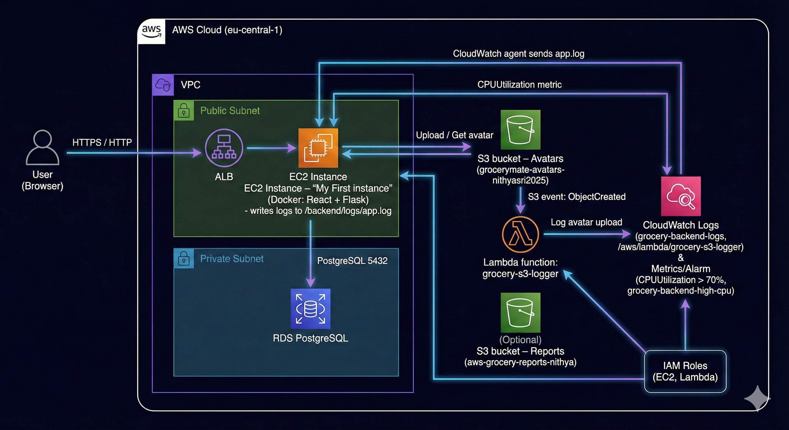
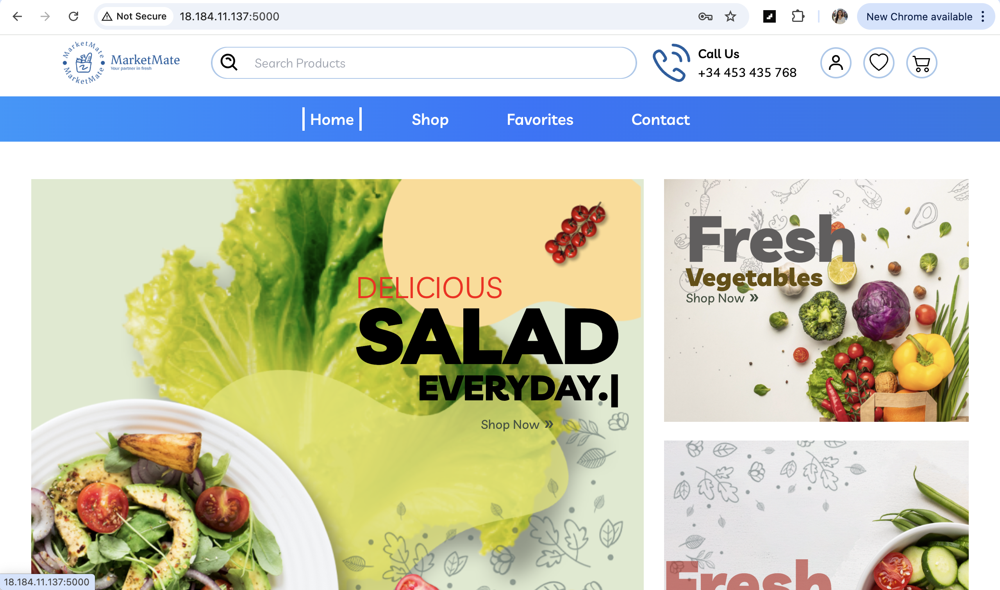
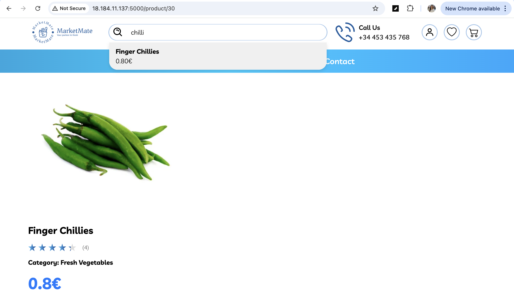
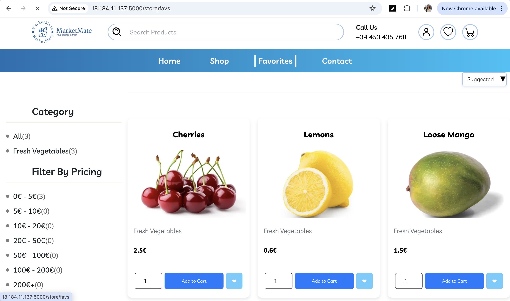
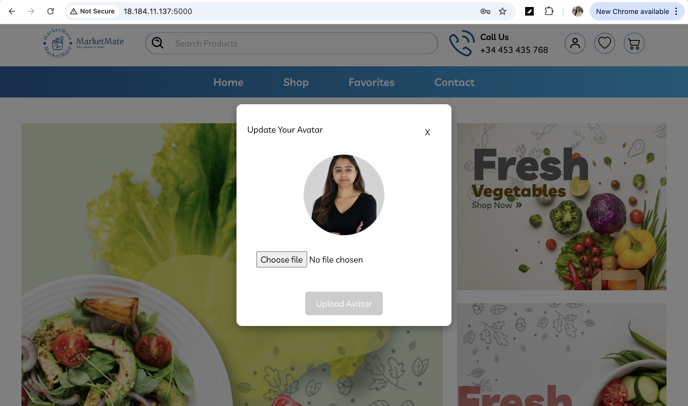

# GroceryMate

## 🏆 GroceryMate E-Commerce Platform

[](https://www.python.org/)
[](https://www.kernel.org/)
[](https://www.postgresql.org/)
[](https://www.terraform.io/)
[](https://github.com/features/actions)
[](https://aws.amazon.com/)

⭐ **Star us on GitHub** — it motivates us a lot!  
> **Credits:** Original application by **Alejandro Román Ibañez**  
> **Cloud deployment + infrastructure work:** **Nithya Srinivasan**

--- 

## 📌 Table of Contents

- [Overview](#-overview)
- [What I Built (Cloud Track)](#-what-i-built-cloud-track)
- [Architecture Diagrams](#-architecture-diagrams)
- [AWS Services Used](#-aws-services-used)
- [Repo Structure](#-repo-structure)
- [Environment Variables](#-environment-variables)
- [Deployment (Terraform + GitHub Actions)](#-deployment-terraform--github-actions)
- [Screenshots](#-screenshots)
- [Troubleshooting](#-troubleshooting)
- [Rollback / Cleanup](#-rollback--cleanup)
- [FAQ](#-faq)
- [Glossary](#-glossary)
- [My Contributions](#-my-contributions)
- [Future Enhancements](#-future-enhancements)
- [License & Credits](#-license--credits)

---

## 🚀 Overview

**GroceryMate** is a full-stack grocery e-commerce app (**React + Flask**) deployed on AWS.

This README is written from a **Cloud Engineer** perspective: it explains the **AWS infrastructure + deployment setup** I implemented around the application.

Core user flows:
- Browse products
- Search products
- Favorites
- Profile avatar upload (S3)

**For the cloud/monitoring module I also implemented:**

* Centralized backend logging with CloudWatch Logs
* A CPUUtilization alarm on the EC2 instance
* An S3-triggered Lambda function that reacts to new avatar uploads and logs them to CloudWatch (serverless, event-driven pattern)

---

## 🧱 What I Built (Cloud Track)

- Provisioned AWS infrastructure using **Terraform**
- Deployed the app on **EC2** (containerized/Docker)
- Configured **RDS (PostgreSQL)** for the application database
- Enabled S3 for avatar uploads (and storage for artifacts/reports if needed)
- Centralized logs using CloudWatch Logs (EC2 agent sends backend/logs/app.log to the log group grocery-backend-logs)
- Created a CloudWatch CPUUtilization alarm for the EC2 instance (“My First instance”) to detect high CPU usage

**Implemented an S3 → Lambda integration:**
- Bucket: grocerymate-avatars-nithyasri2025
- Function: grocery-s3-logger (Python)
- Trigger: “All object create events” in the avatar bucket
- Behavior: logs bucket and object key to CloudWatch Logs (/aws/lambda/grocery-s3-logger) whenever a new avatar is uploaded
- Automated deployment via GitHub Actions (Terraform workflow)

---

## 🗺️ Architecture Diagrams

### ✅ Main Architecture

)

The diagram shows the main user and data flows:

- Users access the app through an Application Load Balancer, which forwards traffic to an EC2 instance running the React frontend and Flask backend in Docker.
- The backend connects to an RDS PostgreSQL database inside a private subnet.
- Profile avatars are stored in the S3 bucket `grocerymate-avatars-nithyasri2025`. New uploads in this bucket trigger the Lambda function `grocery-s3-logger`, which logs the event details to CloudWatch Logs.
- The EC2 instance writes application logs to `backend/logs/app.log`, which are shipped by the CloudWatch agent to the log group `grocery-backend-logs`.
- CloudWatch Metrics and a CPUUtilization alarm monitor the EC2 instance so high CPU usage can be detected.


---

## ☁️ AWS Services Used


| Service                                | Purpose                                                                                                            |
| -------------------------------------- | ------------------------------------------------------------------------------------------------------------------ |
| **EC2**                                | Runs the application (frontend + backend)                                                                          |
| **ALB**                                | Public entrypoint and routing to EC2                                                                               |
| **RDS (PostgreSQL)**                   | Managed database                                                                                                   |
| **S3**                                 | Avatar storage (and optional artifacts/reports) – bucket `grocerymate-avatars-nithyasri2025` for profile images    |
| **IAM**                                | Roles/policies for EC2, Lambda and CI/CD                                                                           |
| **CloudWatch Logs / Metrics / Alarms** | Centralized application logs (`grocery-backend-logs`), Lambda logs, and a CPUUtilization alarm on the EC2 instance |
| **AWS Lambda**                         | `grocery-s3-logger` function triggered by S3 avatar uploads; logs events to CloudWatch (serverless automation)     |
| **VPC + Subnets + Route Tables**       | Network isolation (public + private)                                                                               |
| **Security Groups**                    | Traffic control between components                                                                                 |

---
## 🔍 Monitoring & Serverless Automation

This section describes the concrete work done for the AWS “additional services / monitoring” task.

## CloudWatch Logs for the Backend

The Flask backend writes to backend/logs/app.log.

The CloudWatch agent is installed on the EC2 instance and configured with
file_path: /home/ec2-user/AWS_grocery/backend/logs/app.log.

These logs are sent to the log group grocery-backend-logs in CloudWatch.

Typical log lines include requests such as “Fetching info for user 1” and “Fetched all products”, which helps with debugging and observability.

## CloudWatch CPU Alarm

Metric used: EC2 → CPUUtilization for the backend instance (“My First instance”).

Alarm: grocery-backend-high-cpu

Condition: CPUUtilization > 70% for a 5-minute period.

This gives an early signal if the instance is overloaded and connects monitoring to performance.

## S3 → Lambda Integration (Avatar Uploads)

Bucket: grocerymate-avatars-nithyasri2025 (used by the app for profile avatars).

Lambda function: grocery-s3-logger (Python 3.x).

Trigger: S3 “All object create events” on the avatar bucket.

**Function behavior**:

Reads the S3 event records

Logs the bucket name and object key, e.g.
New object in bucket grocerymate-avatars-nithyasri2025: Application+avatar.png

Logs are written to CloudWatch Logs under /aws/lambda/grocery-s3-logger.

This demonstrates a serverless, event-driven workflow on top of the core application.

## 🗂️ Repo Structure

```text
.
├── backend/
├── frontend/
├── infrastructure/        # Terraform (main deployment)
├── bootstrap/             # Terraform (remote state / initial setup) - if present
├── assets/
│   ├── Diagram/
│   │   └── project-diagram.png
│   └── Screenshots/
│       ├── homepage.png
│       ├── product-search.png
│       ├── favorites.png
│       └── avatar-upload.png
└── README.md
````

---

## 🔐 Environment Variables

Create a `.env` file (example shown below).
✅ Do **not** commit `.env` to GitHub.

Example:

```ini
JWT_SECRET_KEY=your_generated_key

POSTGRES_USER=grocery_user
POSTGRES_PASSWORD=your_password
POSTGRES_DB=grocerymate_db
POSTGRES_HOST=localhost
POSTGRES_URI=postgresql://${POSTGRES_USER}:${POSTGRES_PASSWORD}@${POSTGRES_HOST}:5432/${POSTGRES_DB}
```

(Optional AWS-related variables if your code uses them)

```ini
AWS_REGION=eu-central-1
S3_BUCKET_NAME=your_bucket_name
```

---

## 🚀 Deployment (Terraform + GitHub Actions)

### Prerequisites

* AWS Account
* Terraform installed (if using local apply)
* GitHub Actions configured for deploy (and role/credentials set)

### GitHub Secrets (typical)

Keep names aligned with your workflow. Common ones:

* `TF_VAR_region`
* `TF_VAR_db_user`
* `TF_VAR_db_password`
* `TF_VAR_db_name`
* `TF_VAR_bucket_name`
* `TF_VAR_allowed_ssh_ip` *(optional)*
* `AWS_ROLE_ARN` *(if using OIDC role for GitHub Actions)*

### Deploy Steps (typical)

1. Push to your deploy branch (often `main`)
2. GitHub Actions runs Terraform (init/plan/apply)
3. Verify:

   * Application is reachable via **ALB DNS**
   * `/health` endpoint (if present) returns OK
   * App features work (browse/search/favorites/avatar)
   * CloudWatch shows backend logs and Lambda logs
   * EC2 CPUUtilization alarm is in OK state

---

## 📸 Screenshots

### ✅ Home / Landing



### ✅ Product Search



### ✅ Favorites Page



### ✅ Avatar Upload



---

## 🧯 Troubleshooting

**Terraform apply fails**

* Missing GitHub secrets / TF_VARs
* Wrong region / AMI / permissions
* State lock issues (if DynamoDB used)

**App not loading**

* Check EC2 user-data / cloud-init logs
* Confirm ALB target health checks
* Verify security group rules (ALB → EC2)

**RDS connection errors**

* DB is private: connection must be from EC2 inside VPC
* Missing SG rule: `RDS 5432` from `EC2 SG`
* Wrong endpoint or credentials in `.env`

**S3 upload fails**

* EC2 IAM role missing `s3:PutObject` / `s3:GetObject`
* Wrong bucket name/region

**Lambda not triggered on avatar upload**

* Check S3 bucket event configuration (All object create events)

* Confirm the Lambda trigger is enabled

* Check Lambda’s CloudWatch log group for errors

**CloudWatch logs not appearing**

* Verify CloudWatch agent status on EC2

* Check the file_path in the agent config matches backend/logs/app.log

* Ensure IAM role for EC2 has CloudWatchLogsFullAccess (or equivalent)

**CPU alarm never changes state**

* Confirm the metric is CPUUtilization for the correct instance

* Lower the threshold temporarily to force a state change for testing

---

## 🔁 Rollback / Cleanup

### Destroy infrastructure

```sh
cd infrastructure
terraform destroy
```

If you have bootstrap resources:

```sh
cd ../bootstrap
terraform destroy
```

---

## ❓ FAQ

**How do I change the instance type?**
Update the Terraform variable for `instance_type` and apply.

**How do I access the database?**
Connect from an EC2 instance inside the VPC to the RDS endpoint (RDS is private by design).

**Where are avatars stored?**
In the configured S3 bucket.

---

## 📚 Glossary

* **VPC**: Private network in AWS
* **ALB**: Routes incoming traffic to EC2
* **EC2**: Virtual server to run the app
* **RDS**: Managed PostgreSQL database
* **S3**: Object storage (avatars/files)
* **IAM**: Permissions and roles
* **CloudWatch Logs**: Central logging for EC2 and Lambda
* **CloudWatch Alarm**: Threshold-based alert on a metric (e.g., high CPU)
* **Lambda**: Serverless compute that runs code on events (e.g., S3 uploads)


---

## 🙋‍♀️ My Contributions

* AWS deployment setup (VPC, Subnets, SGs, IAM, ALB, EC2)
* RDS PostgreSQL integration
* S3 integration for avatar upload (grocerymate-avatars-nithyasri2025)
* CloudWatch logging for backend (grocery-backend-logs)
* CloudWatch CPUUtilization alarm for the EC2 instance
* S3 → Lambda integration (grocery-s3-logger reacting to avatar uploads and logging to CloudWatch)
* Terraform structure + deployment workflow (GitHub Actions)
* README documentation + diagrams

---

## 🔮 Future Enhancements

* HTTPS using **ACM + ALB listener**
* **CloudFront** for static assets
* Monitoring dashboards + additional alarms (error rate, latency)
* Autoscaling improvements
* Add caching layer (Redis/ElastiCache)
* Extend the Lambda function to validate/resize avatar images instead of only logging

---

## 📝 License & Credits

MIT License.

**Original project:** Alejandro Román Ibañez
**Cloud deployment + infrastructure documentation:** Nithya Srinivasan (2025)

```
```
